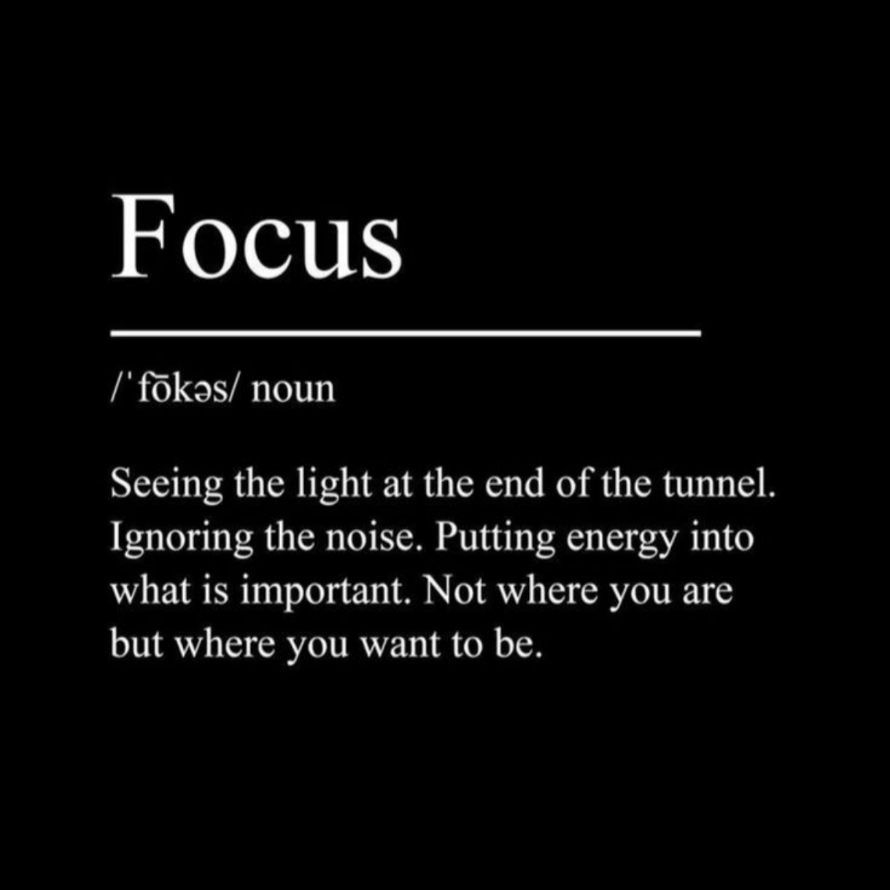

---

&nbsp;

&nbsp;

&nbsp;

---

## About me

Hello! I'm **Aditya Karale**, an AI & ML Engineer fueled by curiosity and an unhealthy obsession with building things that *actually work*.

By day, I turn AI/ML concepts into solid, scalable projects.
By night, I'm deep in vibe coding sessions — where the music hits and the model trains itself *(hopefully)*.

 

&nbsp; **AI & ML Engineering Student**
&nbsp; **Interests** — Deep Learning, Machine Learning, Creative AI
&nbsp; **Beyond code** — Biking, Chess, Content Creation
&nbsp; **Reach me** — adityakarale7@gmail.com
&nbsp; *Build it. Break it. Learn it. Repeat.*

 

---

## Technologies

**Frontend**

**Backend**

**AI / ML**

**Infra & Tools**

---

## Statistics

