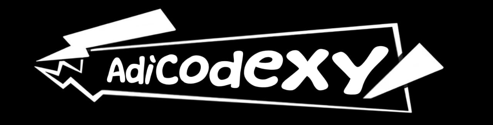

  

 

Transforming raw data into actionable intelligence and digital experiences. Currently deep-diving into Deep Learning, AI development, and creative problem solving. Created to create.

 

  
  
  

