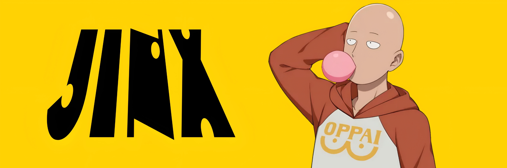

  

 

Transforming raw data into actionable intelligence and digital experiences. Currently deep-diving into Deep Learning, AI development, and creative problem solving. Created to create.

 

  
  
  
  

 

<table>
  <tr>
    <td width="60%" valign="middle">
      <h2>Yoo I'm aditya aka jinx</h2>
      
Co-Founder Of "Custodia", Author of "Death Chanel" &amp; Aspiring Data Scientist

       
      
As for my hobbies, I read a lot of Russian and German literature, I play chess &amp; I write a lot.

       
      
I don't have a lot to say but if you ever wanna talk about anime, games, web series and books, feel free to slide into my Instagram DMs!

    </td>
    <td width="40%" align="center" valign="middle">
      
    </td>
  </tr>
</table>
